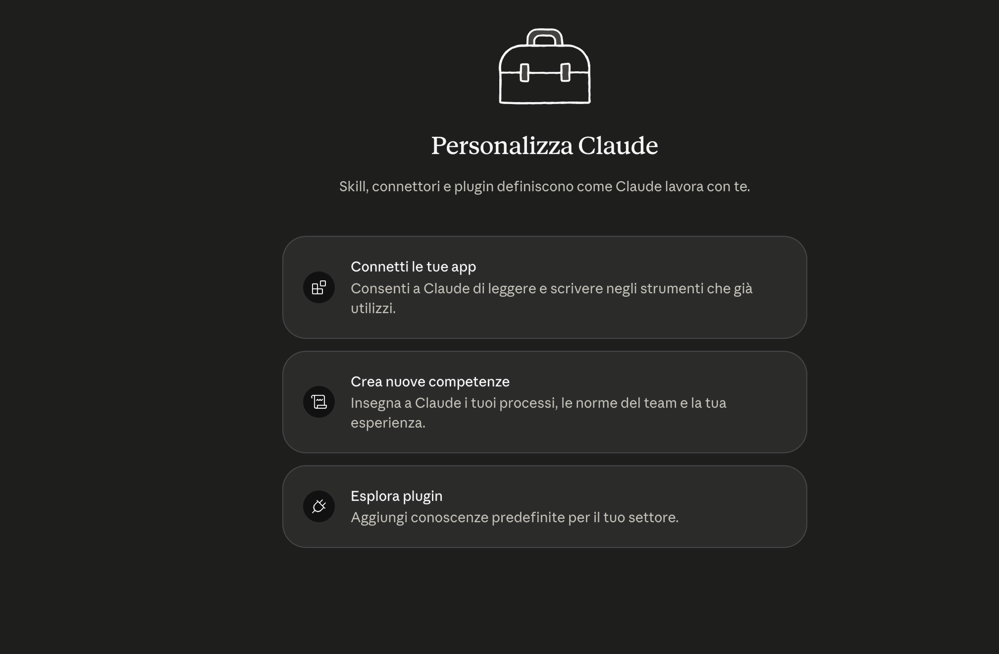
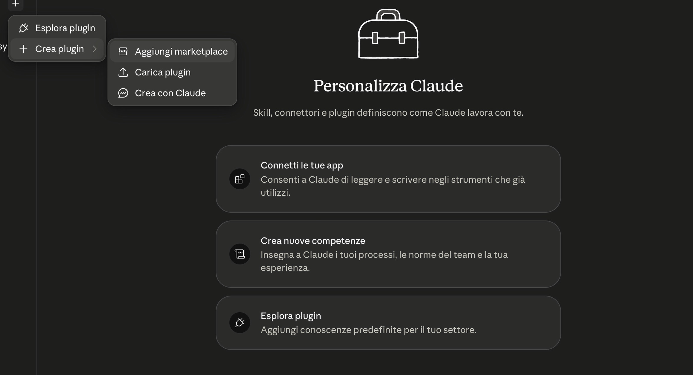
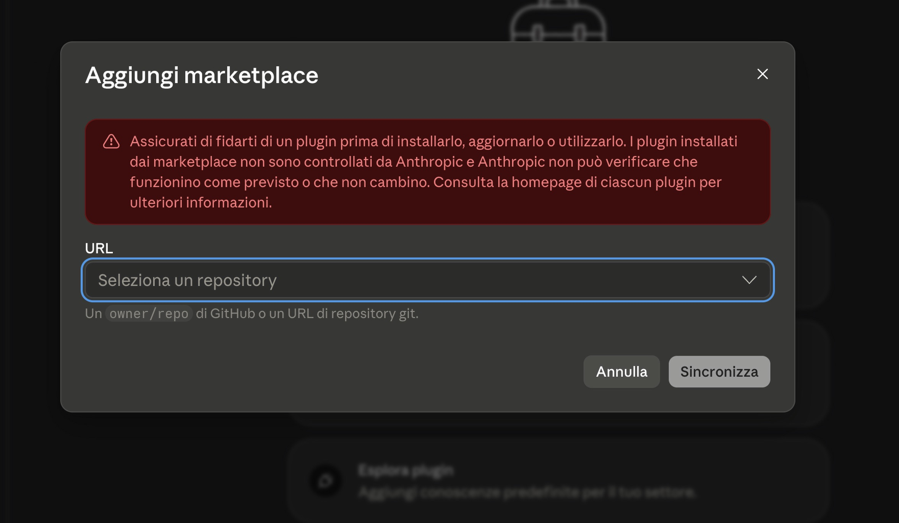
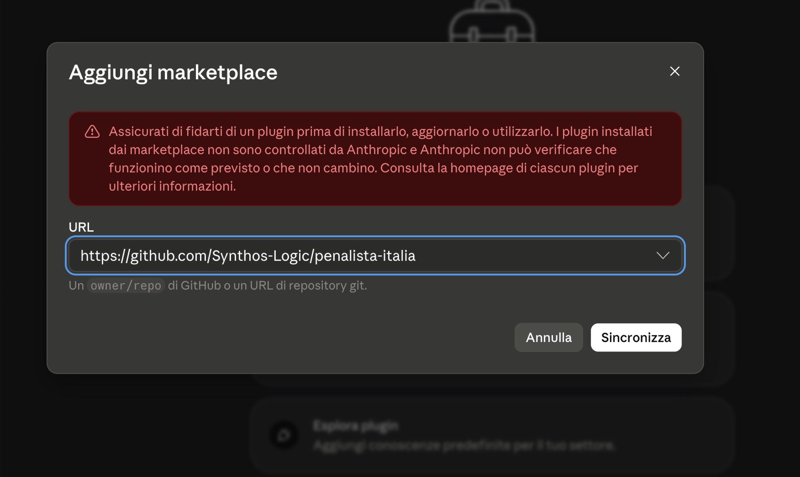
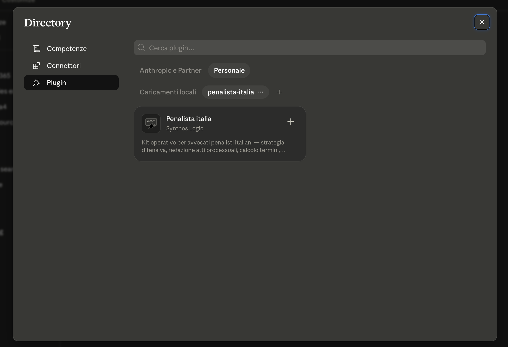
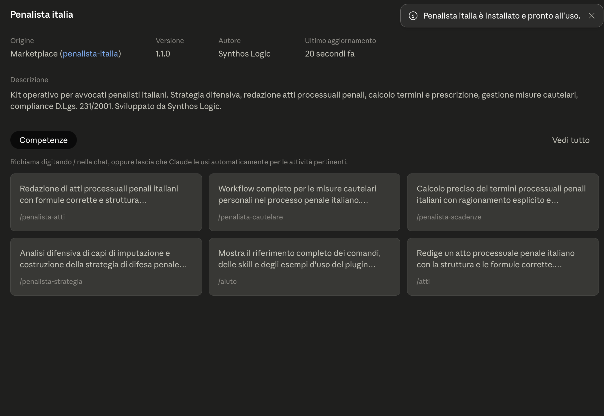
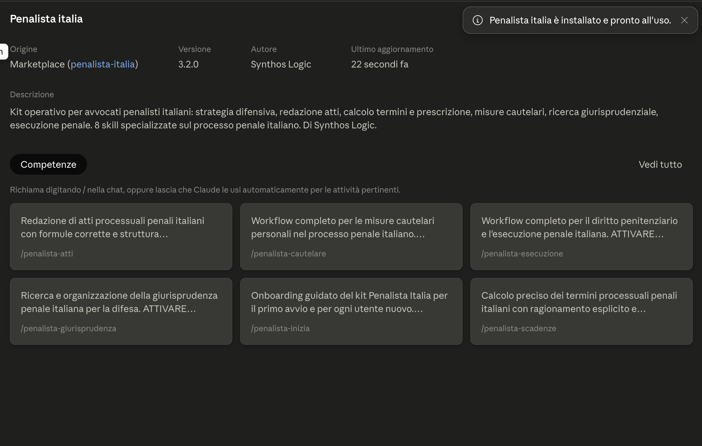
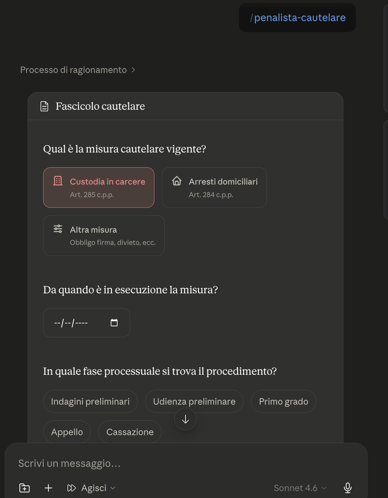

# Installazione del Kit Penalista Italia — guida passo passo

*Tempo richiesto: 5 minuti. Non serve alcuna competenza tecnica.*

**L'installazione vera e propria è una sola: il plugin (Parte 1).** Da quel momento le 8 skill funzionano in ogni conversazione e si aggiornano da sole.

La **cartella dello studio** (Parte 2) non è un secondo passaggio obbligatorio: è l'archivio dove il kit conserva i tuoi fascicoli, i dati del tuo studio e i massimari. Puoi aggiungerla subito o in qualsiasi momento — serve quando inizi a lavorare sui casi reali.

| Componente | A cosa serve | Quando |
|---|---|---|
| **Plugin** (Parte 1) | Le 8 skill — il motore del kit | Subito: è l'installazione |
| **Cartella dello studio** (Parte 2) | Fascicoli, dati studio, Knowledge Base con i tuoi PDF — la memoria del kit | Consigliata: quando lavori sui tuoi casi |

---

## Parte 1 — Installa il plugin (è tutto ciò che serve per iniziare)

### 1. Apri Personalizza

In Claude Desktop, clicca l'icona **Personalizza** in basso a sinistra. Si apre la schermata "Personalizza Claude".



### 2. Aggiungi il marketplace

Clicca il **+** in alto → **Crea plugin** → **Aggiungi marketplace**.



Si apre la finestra "Aggiungi marketplace":



Nel campo URL incolla esattamente:

```
Synthos-Logic/penalista-italia
```

e clicca **Sincronizza**.



### 3. Installa il plugin

Nella Directory (Plugin → **Personale**) compare la scheda **Penalista Italia** di Synthos Logic. Clicca il **+** sulla scheda.



Comparirà la conferma "Penalista italia è installato e pronto all'uso":



### 4. Controlla la scheda del plugin

Cliccando sul plugin vedi versione, autore e le competenze installate:



> La versione mostrata deve corrispondere all'[ultima release](https://github.com/Synthos-Logic/penalista-italia/releases).

### 5. Attiva gli aggiornamenti automatici (consigliato)

Sempre in Plugin → Personale, accanto al nome `penalista-italia` ci sono **tre puntini (···)**. Cliccali e attiva **"Sincronizza automaticamente"**. Da quel momento le nuove versioni delle skill arrivano da sole.

> Se compare una richiesta di autorizzazione GitHub ("Concedi"), è la verifica di accesso al repository: serve un account GitHub gratuito. Se non vuoi crearlo, nessun problema — dallo stesso menu puoi usare **"Verifica aggiornamenti"** quando vuoi, oppure vedi l'[installazione alternativa](../documentazione/INSTALLAZIONE_ALTERNATIVA.md).

### 6. Verifica

Apri una nuova conversazione e scrivi `/penalista-italia:versione`. Deve rispondere con la versione del kit e l'elenco delle 8 skill.

---

## Parte 2 — La cartella dello studio (consigliata, non obbligatoria)

Senza questa cartella il kit funziona, ma **non ricorda**: ogni conversazione riparte da zero sui tuoi casi. Con la cartella, fascicoli, strategie e scadenze restano e si ritrovano. Puoi farlo anche in un secondo momento.

### 1. Scarica lo ZIP

Su [github.com/Synthos-Logic/penalista-italia](https://github.com/Synthos-Logic/penalista-italia) clicca **Code → Download ZIP**.

### 2. Decomprimi e rinomina

Decomprimi lo ZIP e rinomina la cartella in `Penale-Italia`. Mettila dove preferisci (es. Documenti).

### 3. Collegala a Cowork

Claude Desktop → **Cowork** → **Seleziona cartella** → scegli `Penale-Italia`.

---

## Parte 3 — Primo avvio

Ecco come si presenta il kit al lavoro — qui la skill delle misure cautelari raccoglie i dati del fascicolo:




Nella conversazione Cowork con la cartella selezionata, scrivi:

```
Iniziamo
```

Il kit si presenta, raccoglie i dati del tuo studio (nome, foro, tribunale — li chiede una volta sola) e apre con te il primo fascicolo su un caso vero. Quindici minuti.

---

## Problemi comuni

**"Questo repository non è un marketplace"** — Controlla di aver scritto esattamente `Synthos-Logic/penalista-italia` (con il trattino).

**Claude parla di "6 skill" o risponde con versioni vecchie** — Sul computer ci sono residui di versioni precedenti. Pulizia: **Personalizza → Skills** → elimina le eventuali skill `penalista-*` caricate singolarmente (il plugin le sostituisce tutte). Poi apri una conversazione nuova.

**Ho installato un aggiornamento ma non lo vedo** — Gli aggiornamenti valgono per le conversazioni nuove: chiudi quella aperta e aprine un'altra.

**Il pulsante "Aggiorna" sulla scheda del plugin è grigio** — È normale: prima va sincronizzato il catalogo. Usa i **tre puntini (···)** accanto al nome del marketplace → **"Verifica aggiornamenti"**.

**Non voglio usare GitHub** — [Installazione alternativa senza marketplace](../documentazione/INSTALLAZIONE_ALTERNATIVA.md).

---

*Assistenza: apri una segnalazione su [GitHub](https://github.com/Synthos-Logic/penalista-italia/issues) oppure scrivi a Synthos Logic.*
